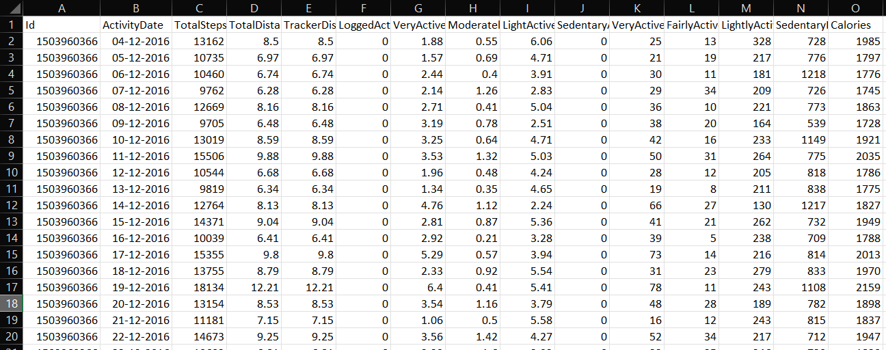
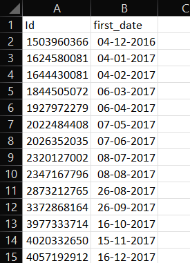
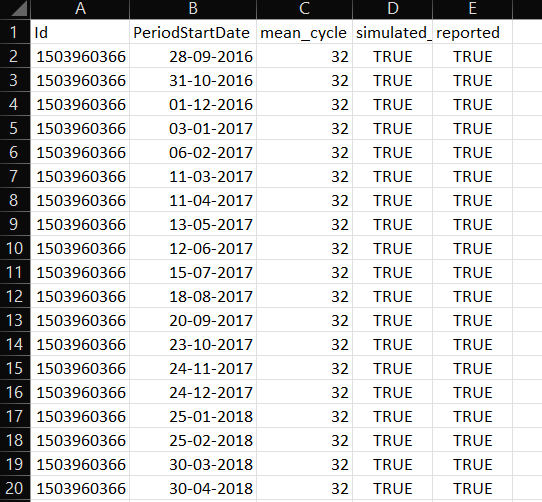
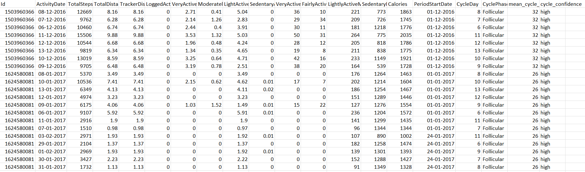
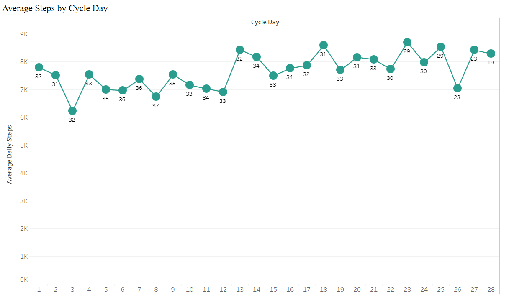
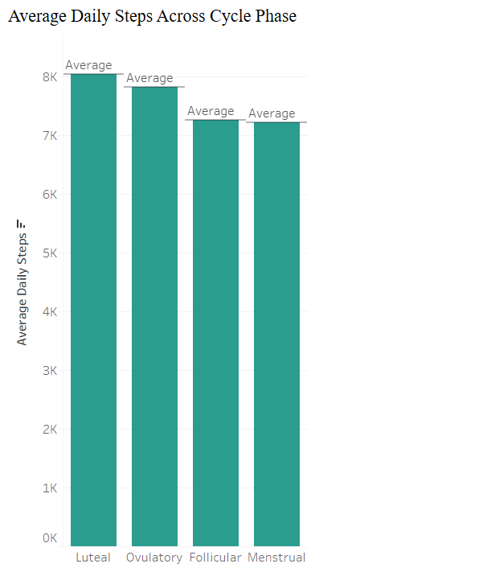
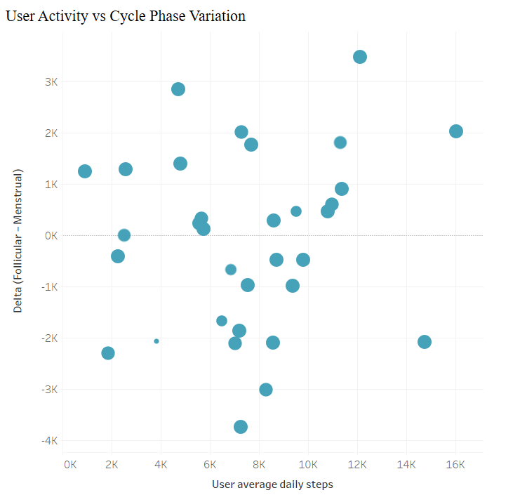
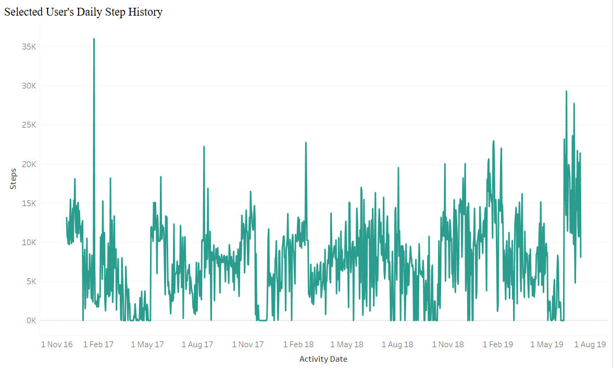
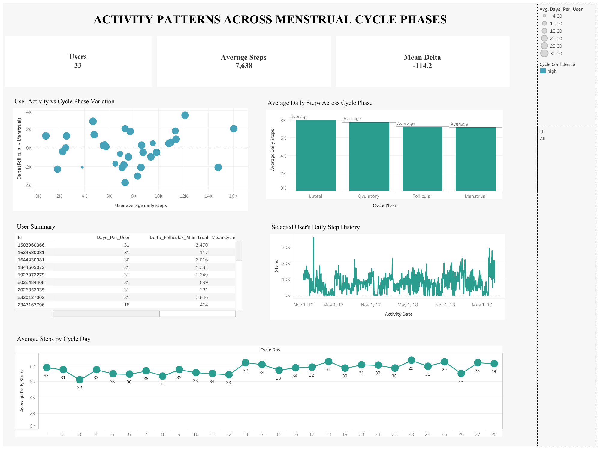

```{r setup, include=FALSE}
knitr::opts_chunk$set(echo = FALSE, warning = FALSE, message = FALSE, dpi=150)
library(tidyverse)
library(lubridate)
library(broom)
```

# Executive Summary

This project performs an end-to-end **data analysis** on Fitbit daily activity data to explore whether activity patterns vary across menstrual cycle phases.  
Using Fitbit data from 33 users (2016–2019) combined with a simulated menstrual cycle dataset, each activity date was matched to a cycle day and cycle phase. All work aligns with a data analyst workflow: data cleaning, preparation, joining, exploratory analysis, descriptive statistics, and visual communication.

## Key Business Question  
Can Bellabeat identify meaningful activity differences across menstrual cycle phases that could support more personalized wellness insights for users?

## What I Did (Data Analyst Workflow)
- Cleaned and validated Fitbit daily activity data.  
- Generated a simulated cycle dataset using R to approximate realistic period start dates.  
- Merged activity + cycle data using structured SQL logic in BigQuery.  
- Performed descriptive analysis in R (cycle-day trends, phase comparisons, user-level differences).  
- Built a Tableau dashboard to communicate findings clearly to stakeholders.  

## Core Analytical Findings
- **Small but consistent differences** in average steps across phases:  
  - Luteal and Ovulatory phases saw slightly higher mean steps  
  - Menstrual phase showed lower average steps  
- **Cycle-day trend** reveals a soft mid-cycle peak around days 13–18  
- **User-level variation dominates the dataset**  
  - Some users show clear cycle-related activity shifts  
  - Others remain steady across phases  
- **Population-level differences were modest**, but user-level insights are still valuable for personalization.

## Why This Matters (Analytics Perspective)
- Insights allow Bellabeat to time recommendations, nudges, or wellness guidance around natural fluctuations.  
- Cycle-confidence (how reliably a user’s cycle can be estimated) can help Bellabeat segment users for targeted messaging.  
- These findings provide *descriptive* foundations — not predictions — to support future product decisions.

## Tools & Skills Demonstrated
- **R**: data cleaning, simulation, analysis, visualization  
- **SQL (BigQuery)**: joins, window functions, date logic  
- **Tableau**: dashboard creation, KPI design  
- **Data analysis skills**: EDA, descriptive statistics, segmentation, data storytelling  
- **Full workflow**: raw → cleaned → engineered → analyzed → visualized

---

## Key Numbers

| Metric | Value |
|--------|------:|
| **Unique users analyzed** | **33** |
| **Average daily steps** | **7,638** |
| **Simulated mean cycle length** | ~28 days |
| **Cycle phases analyzed** | Menstrual, Follicular, Ovulatory, Luteal |
| **Mean Δ (Follicular − Menstrual)** | −114 steps |
| **Cycle days included** | 1–28 |
| **Final merged dataset** | `daily_activity_cycles_full.csv` |

---

# Data & Methods

## Data Sources
This section outlines the datasets used, how they were cleaned and prepared, the methodology behind generating simulated menstrual cycles, how BigQuery was used to merge datasets, and the analytical approach taken during exploratory data analysis. This reflects an end-to-end data analysis workflow suitable for both academic submission and professional review.

### dailyActivity_cleaned.csv
Cleaned Fitbit daily activity data containing steps, calories, sedentary minutes, and intensity metrics. Each row represents one user on one day. 
*excel_dailyActivity_sample.png* 

```{r echo=FALSE, out.width='90%'}

```

### Extracted_Id.csv  
User IDs paired with each user's earliest activity date, used as seed input for menstrual cycle simulation.
*excel_extracted_id.png*  

```{r echo=FALSE, out.width='90%'}

```

### periods_simulated.csv
Simulated period start dates for each user, generated using an R script that applies biologically realistic cycle lengths and variability.
*excel_periods_simulated_sample.png*  

```{r echo=FALSE, out.width='90%'}

```

### daily_activity_cycles_full.csv 
Final merged dataset containing Fitbit activity + simulated menstrual features (CycleDay, CyclePhase, mean_cycle_user, cycle_confidence).
*excel_daily_activity_cycles_full_sample.png*  

```{r echo=FALSE, out.width='90%'}

```

---

## Data Cleaning Summary

Data cleaning was performed using R and basic spreadsheet checks to ensure the Fitbit dataset was ready for downstream analysis.

### Cleaning actions performed
* Verified that no duplicate records existed for any user/date combination
* Standardized all date fields to YYYY-MM-DD format
* Checked all numeric fields (TotalSteps, Calories, SedentaryMinutes) for missing/invalid values
* Confirmed dataset granularity: one row = one user on one day
* Extracted each user's first activity date and Id into Extracted_Id.csv
* Validated input files before simulating periods

These steps ensured consistent and reliable base data before adding menstrual cycle information.

---

## Period Simulation Methodology (R)
Since the provided Fitbit dataset does not include menstrual cycle tracking, a simulated menstrual cycle dataset was generated using R to support cycle-based analysis. The goal was not clinical accuracy, but analytic consistency sufficient for demonstrating how Bellabeat could use cycle-aware insights.

### Simulation logic
Each user was assigned:
* A personalized average cycle length between 24–35 days
* Small random jitter (±2 days) to mimic natural variability
* An occasional “irregular user” pattern with slightly larger variation
* A start-date window tied to their first recorded activity date
* A reporting probability (some periods marked as missed)
Cycles were generated from ~3 months before first activity to ~2 months after last activity to ensure complete alignment.

### Why simulation was necessary
* Real menstrual data is unavailable in this dataset
* Bellabeat’s business case centers on cycle-aware insights
* Simulation allows demonstration of a cycle-aligned analytics pipeline
* The final dataset (periods_simulated.csv) supports day-level and phase-level analysis

### Period Simulation R Code

```{r period_simulation, echo=TRUE}
# simulate_periods_for_activity_window.R (embedded in Rmd)

# Purpose: generate realistic simulated menstrual period start dates per user

library(tidyverse)
library(lubridate)
set.seed(42)   # reproducible

# ---- FILE PATHS (use relative paths) ----
ids_path <- "Extracted_Id.csv"         
out_path <- "periods_simulated.csv"    

# ---- ACTIVITY WINDOW ----
activity_min <- as.Date("2016-12-04")
activity_max <- as.Date("2019-07-01")

start_window_min <- activity_min %m-% months(3)  
start_window_max <- activity_min                  
simulation_end   <- activity_max %m+% months(2)   

# ---- CYCLE PARAMS ----
mean_mu <- 28
mean_sd <- 3
min_cycle <- 24
max_cycle <- 35

miss_rate <- 0.08          
irregular_user_rate <- 0.12

# ---- Read Ids ----
if (!file.exists(ids_path)) stop("Ids file not found: ", ids_path)
ids_df <- read_csv(ids_path, show_col_types = FALSE)

ids_colname <- names(ids_df)[1]
ids_df <- ids_df %>% 
  rename(Id = !!ids_colname) %>% 
  mutate(Id = as.character(Id))

ids <- ids_df$Id

# ---- Generate simulated periods ----
rows <- list()

for (uid in ids) {
  
  mean_cycle_user <- round(rnorm(1, mean_mu, mean_sd))
  mean_cycle_user <- max(min_cycle, min(max_cycle, mean_cycle_user))
  is_irregular <- runif(1) < irregular_user_rate
  
  first_start <- start_window_min + days(sample(0:as.integer(start_window_max - start_window_min), 1))
  cur <- first_start
  
  while (cur <= simulation_end) {
    
    reported_flag <- runif(1) > miss_rate
    
    rows[[length(rows) + 1]] <- tibble(
      Id = as.character(uid),
      PeriodStartDate = cur,
      mean_cycle = mean_cycle_user,
      simulated_flag = TRUE,
      reported = reported_flag
    )
    
    jitter <- sample(-2:2, 1)
    if (is_irregular) jitter <- jitter + sample(-3:3, 1)
    next_interval <- max(21, mean_cycle_user + jitter)
    
    cur <- cur + days(next_interval)
  }
}

periods_simulated <- bind_rows(rows) %>% arrange(Id, PeriodStartDate)

# ---- Save CSV ----
dir.create(dirname(out_path), showWarnings = FALSE, recursive = TRUE)

periods_simulated %>% 
  mutate(PeriodStartDate = format(as.Date(PeriodStartDate), "%Y-%m-%d")) %>% 
  write_csv(out_path)

message("Saved simulated periods to: ", out_path)

# ---- Sanity checks ----
cat("\nSanity checks:\n")
cat("Total simulated starts:", nrow(periods_simulated), "\n")
cat("Unique users:", n_distinct(periods_simulated$Id), "\n")
cat("PeriodStartDate range:", 
    min(periods_simulated$PeriodStartDate), "to", 
    max(periods_simulated$PeriodStartDate), "\n")
cat("Mean cycle (summary):\n")
print(summary(periods_simulated$mean_cycle))
cat("\nSample rows:\n")
print(head(periods_simulated, 12))

```

---

## BigQuery Merge Logic
To align activity with menstrual cycles, BigQuery was used to perform a rolling join (latest period before activity date).

### Method explanation
For each user:
- Each activity date was paired with all possible period start dates
- A window function ranked period starts in descending order
- The “most recent period on or before activity date” was selected
- CycleDay = days since period start + 1
- CyclePhase assigned using standard biological ranges

    * Day 1–5: Menstrual

    * Day 6–13: Follicular

    * Day 14–16: Ovulatory

    * Day 17+: Luteal
Additional user-level metrics (mean_cycle_user, cycle_confidence) were joined for segmentation.

### SQL Code (BigQuery Rolling Join + Final Merge)

```sql
-- Quick preview of uploaded periods table
SELECT *
FROM `iconic-strategy-477903-e4.bellabeat_raw.periods_simulated`
ORDER BY Id, PeriodStartDate
LIMIT 20;

---------------------------------------------------------
-- 1) Create per-user period summary
---------------------------------------------------------
CREATE OR REPLACE TABLE `iconic-strategy-477903-e4.bellabeat_raw.periods_user_summary` AS
SELECT
  Id,
  COUNT(1) AS n_period_starts,
  ROUND(AVG(mean_cycle)) AS mean_cycle_user,
  CASE 
    WHEN COUNT(1) >= 2 THEN 'high' 
    ELSE 'low' 
  END AS cycle_confidence
FROM `iconic-strategy-477903-e4.bellabeat_raw.periods_simulated`
GROUP BY Id;

---------------------------------------------------------
-- 2) Rolling-join: find most recent period before each activity day
---------------------------------------------------------
CREATE OR REPLACE TABLE `iconic-strategy-477903-e4.bellabeat_raw.daily_activity_cycles` AS
WITH candidate_matches AS (
  SELECT
    da.Id,
    da.ActivityDate,
    ps.PeriodStartDate,
    ps.mean_cycle,
    DATE_DIFF(da.ActivityDate, ps.PeriodStartDate, DAY) + 1 AS CycleDay,
    ROW_NUMBER() OVER (
      PARTITION BY da.Id, da.ActivityDate
      ORDER BY ps.PeriodStartDate DESC
    ) AS rn
  FROM `iconic-strategy-477903-e4.bellabeat_raw.cleaned_daily_activity` AS da
  LEFT JOIN `iconic-strategy-477903-e4.bellabeat_raw.periods_simulated` AS ps
    ON da.Id = ps.Id
   AND ps.PeriodStartDate <= da.ActivityDate
)
SELECT
  Id,
  ActivityDate,
  PeriodStartDate,
  mean_cycle,
  CycleDay,
  CASE
    WHEN CycleDay BETWEEN 1 AND 5 THEN 'Menstrual'
    WHEN CycleDay BETWEEN 6 AND 13 THEN 'Follicular'
    WHEN CycleDay BETWEEN 14 AND 16 THEN 'Ovulatory'
    WHEN CycleDay >= 17 THEN 'Luteal'
    ELSE NULL
  END AS CyclePhase
FROM candidate_matches
WHERE rn = 1;

---------------------------------------------------------
-- 3) Enrich with user-level metrics
---------------------------------------------------------
CREATE OR REPLACE TABLE `iconic-strategy-477903-e4.bellabeat_raw.daily_activity_cycles_enriched` AS
SELECT
  c.*,
  p.mean_cycle_user,
  p.cycle_confidence
FROM `iconic-strategy-477903-e4.bellabeat_raw.daily_activity_cycles` AS c
LEFT JOIN `iconic-strategy-477903-e4.bellabeat_raw.periods_user_summary` AS p
  USING (Id);

---------------------------------------------------------
-- 4) Join back to cleaned daily activity table
---------------------------------------------------------
CREATE OR REPLACE TABLE `iconic-strategy-477903-e4.bellabeat_raw.daily_activity_cycles_full` AS
SELECT
  da.*,
  c.PeriodStartDate,
  c.CycleDay,
  c.CyclePhase,
  c.mean_cycle_user,
  c.cycle_confidence
FROM `iconic-strategy-477903-e4.bellabeat_raw.cleaned_daily_activity` AS da
LEFT JOIN `iconic-strategy-477903-e4.bellabeat_raw.daily_activity_cycles_enriched` AS c
  USING (Id, ActivityDate);

---------------------------------------------------------
-- 5) Sanity checks
---------------------------------------------------------

-- Overall matched percentage
SELECT
  COUNT(*) AS total_rows,
  COUNTIF(CycleDay IS NOT NULL) AS matched_rows,
  ROUND(100 * SAFE_DIVIDE(COUNTIF(CycleDay IS NOT NULL), COUNT(*)), 2) AS matched_pct
FROM `iconic-strategy-477903-e4.bellabeat_raw.daily_activity_cycles_full`;

-- Per-phase counts
SELECT 
  CyclePhase, 
  COUNT(*) AS num_days
FROM `iconic-strategy-477903-e4.bellabeat_raw.daily_activity_cycles_full`
GROUP BY CyclePhase
ORDER BY num_days DESC;

-- Per-user matched percentage
SELECT
  Id,
  COUNT(*) AS total_days,
  COUNTIF(CycleDay IS NOT NULL) AS matched_days,
  ROUND(100 * SAFE_DIVIDE(COUNTIF(CycleDay IS NOT NULL), COUNT(*)), 2) AS pct_matched
FROM `iconic-strategy-477903-e4.bellabeat_raw.daily_activity_cycles_full`
GROUP BY Id
ORDER BY pct_matched ASC, total_days DESC
LIMIT 30;
```

---

## Exploratory Data Analysis (R)
The analysis was conducted primarily in R and focused on descriptive, non-predictive insights.

### EDA methods used
* Phase-level summaries: Average steps, variation, and sedentary minutes per phase
* Cycle-day trend: Days 1–28 trendline
* User-level deltas: Comparing mean steps in Follicular vs. Menstrual phases
* Confidence filtering: Subset of users with high cycle-confidence
* Visualization: ggplot2 line charts, bar charts, histograms

The purpose of EDA was to understand patterns, not to build predictive models.

### EDA R Code

```{r eda_analysis, echo=FALSE, eval=TRUE, message=FALSE, warning=FALSE}
# STEP 1: Setup + Load Data
library(tidyverse)
library(lubridate)

# Your file is in the current working directory:
merged_csv <- "daily_activity_cycles_full.csv"

# Load the merged dataset
df <- read_csv(merged_csv, show_col_types = FALSE)

# Convert expected columns to proper types
df <- df %>%
  mutate(
    ActivityDate = as.Date(ActivityDate),
    PeriodStartDate = as.Date(PeriodStartDate),
    CycleDay = as.integer(CycleDay),
    CyclePhase = as.character(CyclePhase),
    Id = as.character(Id)
  )

# ---- Clean readable printed checks ----
cat("Loaded rows:", nrow(df), "\n")
cat("Unique users:", n_distinct(df$Id), "\n")

cat("ActivityDate range:", 
    format(min(df$ActivityDate, na.rm=TRUE)), "to", 
    format(max(df$ActivityDate, na.rm=TRUE)), "\n")

cat("PeriodStartDate range:", 
    format(min(df$PeriodStartDate, na.rm=TRUE)), "to", 
    format(max(df$PeriodStartDate, na.rm=TRUE)), "\n")

cat("Columns present:", paste(names(df), collapse = ", "), "\n\n")

# peek at first 8 rows
print(head(df, 8))

# STEP 2: Global summary checks
library(dplyr)

global_summary <- df %>%
  summarise(
    total_rows = n(),
    rows_with_cycle = sum(!is.na(CycleDay)),
    matched_pct = round(100 * rows_with_cycle / total_rows, 2),
    n_users = n_distinct(Id),
    min_activity = format(min(ActivityDate, na.rm = TRUE)),
    max_activity = format(max(ActivityDate, na.rm = TRUE)),
    min_period = format(min(PeriodStartDate, na.rm = TRUE)),
    max_period = format(max(PeriodStartDate, na.rm = TRUE)),
    mean_cycle_len = round(mean(mean_cycle_user, na.rm = TRUE), 1),
    sd_cycle_len = round(sd(mean_cycle_user, na.rm = TRUE), 1)
  )

print(global_summary)

# Quick CycleDay distribution
cycleday_summary <- df %>%
  filter(!is.na(CycleDay)) %>%
  summarise(
    min_cycleDay = min(CycleDay, na.rm = TRUE),
    q1 = quantile(CycleDay, 0.25, na.rm = TRUE),
    median = median(CycleDay, na.rm = TRUE),
    q3 = quantile(CycleDay, 0.75, na.rm = TRUE),
    max_cycleDay = max(CycleDay, na.rm = TRUE),
    mean_cycleDay = round(mean(CycleDay, na.rm = TRUE), 1),
    sd_cycleDay = round(sd(CycleDay, na.rm = TRUE), 1)
  )

print(cycleday_summary)

# save summaries
dir.create("analysis_outputs", showWarnings = FALSE)
write.csv(global_summary, "analysis_outputs/global_summary.csv", row.names = FALSE)
write.csv(cycleday_summary, "analysis_outputs/cycleday_summary.csv", row.names = FALSE)


# STEP 3: Phase-level summary + bar plot
library(tidyverse)

# ensure df is loaded from previous step
# df <- read_csv("daily_activity_cycles_full.csv") # if needed

# compute phase-level summary
phase_summary <- df %>%
  filter(!is.na(CyclePhase)) %>%
  group_by(CyclePhase) %>%
  summarise(
    n_days = n(),
    avg_steps = round(mean(TotalSteps, na.rm=TRUE), 0),
    sd_steps = round(sd(TotalSteps, na.rm=TRUE), 1),
    se_steps = round(sd_steps / sqrt(n_days), 1),
    avg_cal = round(mean(Calories, na.rm=TRUE), 0),
    avg_sedentary = round(mean(SedentaryMinutes, na.rm=TRUE), 1)
  ) %>%
  arrange(desc(avg_steps))

print(phase_summary)

# Save CSV
dir.create("analysis_outputs", showWarnings = FALSE)
write_csv(phase_summary, "analysis_outputs/phase_summary.csv")

# Plot avg steps by phase with error bars (se)
phase_plot <- phase_summary %>%
  mutate(CyclePhase = factor(CyclePhase, levels = CyclePhase))

p_phase <- ggplot(phase_plot, aes(x=CyclePhase, y=avg_steps)) +
  geom_col() +
  geom_errorbar(aes(ymin = avg_steps - se_steps, ymax = avg_steps + se_steps), width = 0.2) +
  labs(title = "Average Steps by Cycle Phase", x = "Cycle Phase", y = "Average Steps") +
  theme_minimal(base_size = 14)

ggsave("analysis_outputs/phase_avg_steps.png", p_phase, width = 8, height = 5, dpi = 300)
print(p_phase)

# STEP 4: CycleDay trend (avg steps by CycleDay 1-28)
library(tidyverse)

day_trend <- df %>%
  filter(!is.na(CycleDay), CycleDay >= 1, CycleDay <= 28) %>%
  group_by(CycleDay) %>%
  summarise(
    avg_steps = round(mean(TotalSteps, na.rm = TRUE), 0),
    sd_steps = round(sd(TotalSteps, na.rm = TRUE), 1),
    n = n()
  ) %>%
  arrange(CycleDay)

# Save CSV
write_csv(day_trend, "analysis_outputs/cycleday_trend.csv")

# Plot
p_day <- ggplot(day_trend, aes(x = CycleDay, y = avg_steps)) +
  geom_line() +
  geom_point(aes(size = pmin(n, 200)), alpha = 0.8) +   # size ~ observation count (capped)
  scale_size_continuous(name = "n (capped at 200)") +
  labs(title = "Average Steps by Cycle Day (1–28)", x = "Cycle Day", y = "Average Steps") +
  theme_minimal(base_size = 13)

ggsave("analysis_outputs/cycleday_avg_steps.png", p_day, width = 9, height = 4.5, dpi = 300)
print(p_day)

# STEP 5: Per-user delta (Follicular - Menstrual)
user_phase_stats <- df %>%
  filter(!is.na(CyclePhase)) %>%
  group_by(Id, CyclePhase) %>%
  summarise(mean_steps = mean(TotalSteps, na.rm = TRUE), .groups = "drop") %>%
  pivot_wider(names_from = CyclePhase, values_from = mean_steps) %>%
  mutate(delta_fol_minus_men = Follicular - Menstrual)

user_delta <- user_phase_stats %>% filter(!is.na(delta_fol_minus_men))

write_csv(user_delta, "analysis_outputs/user_delta_fol_minus_men.csv")

p_delta <- ggplot(user_delta, aes(x = delta_fol_minus_men)) +
  geom_histogram(bins = 12) +
  labs(title = "Per-user: Follicular − Menstrual (Avg Steps)", x = "Delta (Follicular − Menstrual)", y = "Number of users") +
  theme_minimal(base_size = 13)

ggsave("analysis_outputs/user_delta_hist.png", p_delta, width = 8, height = 4, dpi = 300)
print(p_delta)

# Statistical comparison: Menstrual vs Follicular
men <- df %>% filter(CyclePhase == "Menstrual") %>% pull(TotalSteps)
fol <- df %>% filter(CyclePhase == "Follicular") %>% pull(TotalSteps)

t_res <- t.test(fol, men, alternative = "greater")
wil_res <- wilcox.test(fol, men, alternative = "greater")

t_res
wil_res

# Per-user test (paired at user-level): compute each user’s mean in each phase and then test whether the user-level deltas differ from 0. This avoids conflating within-user correlation.
library(broom)
user_means <- df %>%
  filter(!is.na(CyclePhase)) %>%
  group_by(Id, CyclePhase) %>%
  summarise(mean_steps = mean(TotalSteps, na.rm=TRUE), .groups="drop") %>%
  pivot_wider(names_from = CyclePhase, values_from = mean_steps) %>%
  mutate(delta = Follicular - Menstrual) %>%
  filter(!is.na(delta))

# One-sample t-test on deltas (is mean delta > 0?)
t.test(user_means$delta, mu = 0, alternative = "greater") %>% tidy()

# report mean delta and basic descriptives
mean_delta <- mean(user_means$delta); sd_delta <- sd(user_means$delta)
mean_delta; sd_delta

#Effect size (Cohen's d) for user-level delta:

cohens_d <- mean_delta / sd_delta
cohens_d
# interpret: 0.2 small, 0.5 medium, 0.8 large

#Check results only for high-confidence users
high_users <- df %>% filter(cycle_confidence == "high")

user_means_high <- high_users %>%
  group_by(Id, CyclePhase) %>%
  summarise(mean_steps = mean(TotalSteps, na.rm=TRUE), .groups="drop") %>%
  pivot_wider(names_from = CyclePhase, values_from = mean_steps) %>%
  mutate(delta = Follicular - Menstrual) %>%
  filter(!is.na(delta))

t.test(user_means_high$delta, mu = 0, alternative = "greater") %>% tidy()
mean(user_means_high$delta); sd(user_means_high$delta)

# cap CycleDay at mean cycle length per user (reduces outlier long CycleDay)
df_capped <- df %>%
  mutate(max_day = mean_cycle_user,
         CycleDay_capped = ifelse(!is.na(CycleDay) & !is.na(max_day) & CycleDay > max_day, NA, CycleDay))

# Recompute day trend:
day_trend_capped <- df_capped %>%
  filter(!is.na(CycleDay_capped), CycleDay_capped >=1, CycleDay_capped <=28) %>%
  group_by(CycleDay_capped) %>%
  summarise(avg_steps = mean(TotalSteps, na.rm=TRUE), n = n()) %>%
  arrange(CycleDay_capped)
```

---

# Results & Figures
This section presents the core findings from the exploratory analysis. Each figure is followed by a short interpretation written for product stakeholders and hiring reviewers.

## Cycle-day trend (1–28)
```{r fig.cap="Average daily steps by cycle day (1–28). Point size ~ sample count (capped).", echo=FALSE, out.width='95%'}

```

### What this shows
A gentle mid-cycle rise is visible around days ~13–18. Average steps are fairly stable across most days with a modest peak in the peri-ovulatory window. Sample counts vary by day (point size), which is why we capped the size to avoid extreme scaling.

### Interpretation
* Population-level signal: small mid-cycle uptick.
* Practical implication: population averages are modest; personalization would be more actionable than blanket product changes.

## Phase-level averages
```{r echo=FALSE, out.width='60%'}

```

### What this shows
Bar chart of mean daily steps per phase, with standard-error style error bars. Luteal and Ovulatory show the higher means, Menstrual shows the lowest.

### Interpretation
* Differences are present but small in magnitude.
* For product: consider lighter activity suggestions or different messaging during Menstrual days; test on high-confidence users first.

## Per-user variation
```{r echo=FALSE, out.width='60%'}

```

### What this shows
Histogram of users’ mean deltas (Follicular − Menstrual). Spread is wide and centered near zero.

### Interpretation
* Many users show little change; some show meaningful positive or negative deltas.
* This supports a personalization-first strategy: segment users by delta or cycle_confidence and test targeted nudges.

## Example user time-series
```{r echo=FALSE, out.width='95%'}

```

### What this shows
A real user’s daily steps plotted over time, with cycle-phase shading (where present). It demonstrates intra-user variability and occasional sustained changes.

### Interpretation
* Individual behaviour is noisy; event-level and context-level signals (travel, holidays) matter.
* Recommend combining cycle signals with contextual filters (e.g., travel flag, device-wear flag).

## Full dashboard snapshot
```{r echo=FALSE, out.width='100%'}

```

### How to use the dashboard
* Use ID filter to drill down to a single user.
* Examine KPI strips for quick metrics (avg steps, mean delta, user count).
* Use phase and cycle-day charts to validate targeting decisions.

## Short quantitative summary (from analysis outputs)
* Unique users: 33
* Overall average daily steps: ~7,638
* Mean delta (Follicular − Menstrual) at user-level: ~−114 steps (small effect)
* Cycle-day window analyzed: 1–28
* Example files generated: phase_summary.csv, cycleday_trend.csv, user_delta_fol_minus_men.csv
(Full CSVs and plots are in analysis_outputs/.)

---

# Insights

This analysis provides several meaningful insights into how daily activity patterns relate to menstrual cycle phases. The findings highlight both population-level patterns and important user-level variability that Bellabeat can leverage in product design.

---

## Population-Level Patterns

### **Small but consistent menstrual-phase differences**
Across all users combined, average daily steps show a modest pattern:

- **Highest activity:** Ovulatory and Luteal phases  
- **Lower activity:** Menstrual and early Follicular phases  
- **Effect size is small**, meaning differences are real but not dramatic

This suggests that physical activity fluctuates gently throughout the cycle, but not enough to drive population-level decisions alone.

---

## Cycle-Day Patterns

### **Mid-cycle rise around days 13–18**
The cycle-day trend shows a visible but gentle uplift in activity around the mid-cycle window.

This aligns with:

- Higher energy levels during ovulation  
- Lower fatigue compared to early cycle  

This pattern appears in aggregate but varies across users.

---

## Strong Individual Differences

### **User-level variability dominates the dataset**
The histogram of per-user deltas (Follicular − Menstrual steps) shows:

- Many users cluster near zero difference  
- Some users are “cycle-sensitive”  
- Some show the *opposite* pattern  

This tells us:

✔ Cycle influences behavior — **but differently for each user**  
✔ Personalization is more important than global rules  
✔ Bellabeat should avoid one-size-fits-all recommendations  

---

## Cycle Confidence Matters

Users with higher estimated cycle confidence (more consistent simulated patterns):

- Show cleaner phase-based behavior
- Are better candidates for cycle-aware product features
- Provide more stable behavior profiles for personalized insights

This suggests segmentation is key.

---

## Real-World Variability

The user time-series display shows:

- Day-to-day variation can overshadow phase effects  
- External factors (schedule, work, sleep, travel) play a major role  
- Cycle signals are subtle compared to life events  

This reinforces the idea that **cycle effects are meaningful but not dominant**.

---

## Summary of Insights

- Cycle phases do influence activity, but the **effect is mild** on average.  
- Mid-cycle (ovulatory/luteal) is typically the **most active window**.  
- Menstrual days tend to show **lower energy and fewer steps**.  
- Individual patterns vary widely — personalization is essential.  
- Confidence-based segmentation can improve feature accuracy.  


---

# Recommendations

Based on the analysis, Bellabeat can improve personalization and user engagement by applying the following key recommendations:

---

## Personalize Activity Nudges by Cycle Phase
- **Menstrual:** suggest lighter movement, rest-friendly routines  
- **Ovulatory/Luteal:** promote higher-energy or longer-duration activities  
These nudges align with the small but consistent phase differences observed.

---

## Use Cycle-Confidence Segmentation
Cycle effects vary widely across users.  
Bellabeat should:
- Target phase-based insights to **high-confidence** users  
- Keep recommendations general for low-confidence or irregular users  

---

## Encourage Better Cycle Logging
More accurate cycle data leads to better personalization.  
Bellabeat should nudge users to:
- Log periods consistently  
- Update symptoms  
- Verify predicted cycle dates  

---

## Combine Cycle Signals With Context
Cycle effects are subtle compared to factors like stress, sleep, or work schedule.  
Blend cycle insights with:
- Sleep patterns  
- Activity history  
- User context (e.g., travel days)  

This avoids over-attributing changes to the cycle alone.

---

## Use Dashboard for Product Testing & Exploration
The dashboard you built helps teams quickly:
- Review population vs. individual patterns  
- Identify cycle-sensitive segments  
- Prototype and refine feature ideas  

---

### Strategic Summary
- Personalize where confidence is high  
- Keep messaging gentle and supportive during low-energy phases  
- Encourage more logging  
- Combine cycle and contextual signals for smarter recommendations  

---

# Business Impact

The findings of this analysis support several meaningful opportunities for Bellabeat’s product, retention, and user-engagement strategies.

---

## More Personalized Wellness Guidance  
Cycle-aware activity insights—especially for high-confidence users—allow Bellabeat to deliver recommendations that feel timely, empathetic, and relevant.  
This strengthens daily engagement and positions Bellabeat as a “body-aware” companion rather than a generic fitness app.

---

## Higher User Retention  
Subtle, supportive nudges during low-energy phases (Menstrual) and motivating prompts during higher-energy phases (Ovulatory/Luteal) can increase:

- return-to-app behavior  
- streak continuation  
- consistent tracking habits  

Better personalization → better long-term retention.

---

## Better Segmentation for Product & Marketing  
Cycle-confidence and user-level deltas offer **new segmentation dimensions**:

- High-confidence cycle users  
- Cycle-sensitive vs. cycle-neutral users  
- Users needing logging support  

These segments help Bellabeat tailor messaging, notifications, and wellness programs.

---

## Strong Foundation for A/B Testing  
The analysis identifies clear hypotheses for experimentation:

- Cycle-aware prompts vs general prompts  
- Activity suggestions during different phases  
- Adaptive goals based on user-level deltas  

This is directly actionable by product teams.

---

## Supports Bellabeat’s Vision of Whole-Body Wellness  
By integrating cycle context with activity data, Bellabeat can expand beyond step tracking and deepen its positioning as a women’s health platform—supporting holistic wellness, not just fitness metrics.


# Limitations

While the analysis provides meaningful insights, several limitations should be noted to ensure accurate interpretation.

---

## Simulated Cycle Data  
The menstrual cycle data used in this project was *simulated*, not self-reported.  
Although biologically reasonable patterns were used, simulated data cannot fully capture:

- real hormonal variability  
- irregular cycles  
- user-specific symptoms or patterns  

As a result, findings should be interpreted as **analytic prototypes**, not medical conclusions.

---

## Fitbit Dataset Constraints  
The Fitbit dataset:

- covers only 33 users  
- spans 2016–2019 (older data)  
- includes step and activity metrics but no sleep, stress, or symptoms  
- does not reflect Bellabeat’s actual user population  

This limits generalizability.

---

## External Factors Not Modeled  
Daily activity varies due to:

- work schedules  
- travel  
- illness  
- sleep  
- device non-wear  

These factors can blur or outweigh cycle-driven differences.  
Cycle effects are real but subtle relative to life context.

---

## Confidence-Based Limitations  
Cycle confidence was inferred from the consistency of simulated data.  
Low-confidence users may appear less cycle-sensitive simply due to:

- short tracking windows  
- inconsistent data  
- irregular cycle patterns  

This affects accuracy.

---

## Cross-Sectional Nature  
The analysis is descriptive, not predictive.  
It identifies correlations, not causal relationships.

---

### Summary  
These limitations do not invalidate the analysis but highlight why future work should incorporate real cycle data and broader health signals.

---

# Next Steps

The analysis provides a strong foundation, but the following steps would significantly improve accuracy and product value:

---

## Use Real Cycle-Tracking Data
Replacing simulated cycles with actual user-logged periods would strengthen:

- phase accuracy  
- confidence scoring  
- personalization quality  

---

## Incorporate Additional Health Signals
Integrate sleep, stress, symptom tracking, and device wear patterns to better understand *why* activity changes across the cycle.

---

## Identify Cycle-Sensitive vs. Cycle-Neutral Users
With more data, Bellabeat can cluster users by how strongly their activity varies by phase — supporting more targeted recommendations.

---

## Prepare for A/B Testing
Develop and test:

- cycle-aware reminders  
- adaptive activity goals  
- personalized wellness prompts for high-confidence users  

---

## Enhance Dashboard Functionality
Add filters (symptoms, sleep, context tags) to help internal teams explore more detailed user patterns.

---

# Appendix

This appendix contains optional supplemental material for reviewers who want to explore the full technical workflow. All main insights and figures appear in earlier sections; the appendix provides transparency and reproducibility.

---

## Full Period Simulation Script
The complete R script used to generate `periods_simulated.csv` is included below for reference.

```{r period_simulation_full, echo=TRUE}
# simulate_periods_for_activity_window.R (embedded in Rmd)

# Purpose: generate realistic simulated menstrual period start dates per user

library(tidyverse)
library(lubridate)
set.seed(42)   # reproducible

# ---- FILE PATHS (use relative paths) ----
ids_path <- "Extracted_Id.csv"         
out_path <- "periods_simulated.csv"    

# ---- ACTIVITY WINDOW ----
activity_min <- as.Date("2016-12-04")
activity_max <- as.Date("2019-07-01")

start_window_min <- activity_min %m-% months(3)  
start_window_max <- activity_min                  
simulation_end   <- activity_max %m+% months(2)   

# ---- CYCLE PARAMS ----
mean_mu <- 28
mean_sd <- 3
min_cycle <- 24
max_cycle <- 35

miss_rate <- 0.08          
irregular_user_rate <- 0.12

# ---- Read Ids ----
if (!file.exists(ids_path)) stop("Ids file not found: ", ids_path)
ids_df <- read_csv(ids_path, show_col_types = FALSE)

ids_colname <- names(ids_df)[1]
ids_df <- ids_df %>% 
  rename(Id = !!ids_colname) %>% 
  mutate(Id = as.character(Id))

ids <- ids_df$Id

# ---- Generate simulated periods ----
rows <- list()

for (uid in ids) {
  
  mean_cycle_user <- round(rnorm(1, mean_mu, mean_sd))
  mean_cycle_user <- max(min_cycle, min(max_cycle, mean_cycle_user))
  is_irregular <- runif(1) < irregular_user_rate
  
  first_start <- start_window_min + days(sample(0:as.integer(start_window_max - start_window_min), 1))
  cur <- first_start
  
  while (cur <= simulation_end) {
    
    reported_flag <- runif(1) > miss_rate
    
    rows[[length(rows) + 1]] <- tibble(
      Id = as.character(uid),
      PeriodStartDate = cur,
      mean_cycle = mean_cycle_user,
      simulated_flag = TRUE,
      reported = reported_flag
    )
    
    jitter <- sample(-2:2, 1)
    if (is_irregular) jitter <- jitter + sample(-3:3, 1)
    next_interval <- max(21, mean_cycle_user + jitter)
    
    cur <- cur + days(next_interval)
  }
}

periods_simulated <- bind_rows(rows) %>% arrange(Id, PeriodStartDate)

# ---- Save CSV ----
dir.create(dirname(out_path), showWarnings = FALSE, recursive = TRUE)

periods_simulated %>% 
  mutate(PeriodStartDate = format(as.Date(PeriodStartDate), "%Y-%m-%d")) %>% 
  write_csv(out_path)

message("Saved simulated periods to: ", out_path)

# ---- Sanity checks ----
cat("\nSanity checks:\n")
cat("Total simulated starts:", nrow(periods_simulated), "\n")
cat("Unique users:", n_distinct(periods_simulated$Id), "\n")
cat("PeriodStartDate range:", 
    min(periods_simulated$PeriodStartDate), "to", 
    max(periods_simulated$PeriodStartDate), "\n")
cat("Mean cycle (summary):\n")
print(summary(periods_simulated$mean_cycle))
cat("\nSample rows:\n")
print(head(periods_simulated, 12))

```

---

## BigQuery SQL (Cycle Alignment Logic)
The SQL logic for rolling joins and cycle alignment is included for completeness.

```sql
-- Quick preview of uploaded periods table
SELECT *
FROM `iconic-strategy-477903-e4.bellabeat_raw.periods_simulated`
ORDER BY Id, PeriodStartDate
LIMIT 20;

---------------------------------------------------------
-- 1) Create per-user period summary
---------------------------------------------------------
CREATE OR REPLACE TABLE `iconic-strategy-477903-e4.bellabeat_raw.periods_user_summary` AS
SELECT
  Id,
  COUNT(1) AS n_period_starts,
  ROUND(AVG(mean_cycle)) AS mean_cycle_user,
  CASE 
    WHEN COUNT(1) >= 2 THEN 'high' 
    ELSE 'low' 
  END AS cycle_confidence
FROM `iconic-strategy-477903-e4.bellabeat_raw.periods_simulated`
GROUP BY Id;

---------------------------------------------------------
-- 2) Rolling-join: find most recent period before each activity day
---------------------------------------------------------
CREATE OR REPLACE TABLE `iconic-strategy-477903-e4.bellabeat_raw.daily_activity_cycles` AS
WITH candidate_matches AS (
  SELECT
    da.Id,
    da.ActivityDate,
    ps.PeriodStartDate,
    ps.mean_cycle,
    DATE_DIFF(da.ActivityDate, ps.PeriodStartDate, DAY) + 1 AS CycleDay,
    ROW_NUMBER() OVER (
      PARTITION BY da.Id, da.ActivityDate
      ORDER BY ps.PeriodStartDate DESC
    ) AS rn
  FROM `iconic-strategy-477903-e4.bellabeat_raw.cleaned_daily_activity` AS da
  LEFT JOIN `iconic-strategy-477903-e4.bellabeat_raw.periods_simulated` AS ps
    ON da.Id = ps.Id
   AND ps.PeriodStartDate <= da.ActivityDate
)
SELECT
  Id,
  ActivityDate,
  PeriodStartDate,
  mean_cycle,
  CycleDay,
  CASE
    WHEN CycleDay BETWEEN 1 AND 5 THEN 'Menstrual'
    WHEN CycleDay BETWEEN 6 AND 13 THEN 'Follicular'
    WHEN CycleDay BETWEEN 14 AND 16 THEN 'Ovulatory'
    WHEN CycleDay >= 17 THEN 'Luteal'
    ELSE NULL
  END AS CyclePhase
FROM candidate_matches
WHERE rn = 1;

---------------------------------------------------------
-- 3) Enrich with user-level metrics
---------------------------------------------------------
CREATE OR REPLACE TABLE `iconic-strategy-477903-e4.bellabeat_raw.daily_activity_cycles_enriched` AS
SELECT
  c.*,
  p.mean_cycle_user,
  p.cycle_confidence
FROM `iconic-strategy-477903-e4.bellabeat_raw.daily_activity_cycles` AS c
LEFT JOIN `iconic-strategy-477903-e4.bellabeat_raw.periods_user_summary` AS p
  USING (Id);

---------------------------------------------------------
-- 4) Join back to cleaned daily activity table
---------------------------------------------------------
CREATE OR REPLACE TABLE `iconic-strategy-477903-e4.bellabeat_raw.daily_activity_cycles_full` AS
SELECT
  da.*,
  c.PeriodStartDate,
  c.CycleDay,
  c.CyclePhase,
  c.mean_cycle_user,
  c.cycle_confidence
FROM `iconic-strategy-477903-e4.bellabeat_raw.cleaned_daily_activity` AS da
LEFT JOIN `iconic-strategy-477903-e4.bellabeat_raw.daily_activity_cycles_enriched` AS c
  USING (Id, ActivityDate);

---------------------------------------------------------
-- 5) Sanity checks
---------------------------------------------------------

-- Overall matched percentage
SELECT
  COUNT(*) AS total_rows,
  COUNTIF(CycleDay IS NOT NULL) AS matched_rows,
  ROUND(100 * SAFE_DIVIDE(COUNTIF(CycleDay IS NOT NULL), COUNT(*)), 2) AS matched_pct
FROM `iconic-strategy-477903-e4.bellabeat_raw.daily_activity_cycles_full`;

-- Per-phase counts
SELECT 
  CyclePhase, 
  COUNT(*) AS num_days
FROM `iconic-strategy-477903-e4.bellabeat_raw.daily_activity_cycles_full`
GROUP BY CyclePhase
ORDER BY num_days DESC;

-- Per-user matched percentage
SELECT
  Id,
  COUNT(*) AS total_days,
  COUNTIF(CycleDay IS NOT NULL) AS matched_days,
  ROUND(100 * SAFE_DIVIDE(COUNTIF(CycleDay IS NOT NULL), COUNT(*)), 2) AS pct_matched
FROM `iconic-strategy-477903-e4.bellabeat_raw.daily_activity_cycles_full`
GROUP BY Id
ORDER BY pct_matched ASC, total_days DESC
LIMIT 30;
```
--- 

## Exploratory Data Analysis

```{r eda_script_display, echo=TRUE, eval=FALSE}
# STEP 1: Setup + Load Data
library(tidyverse)
library(lubridate)

# Your file is in the current working directory:
merged_csv <- "daily_activity_cycles_full.csv"

# Load the merged dataset
df <- read_csv(merged_csv, show_col_types = FALSE)

# Convert expected columns to proper types
df <- df %>%
  mutate(
    ActivityDate = as.Date(ActivityDate),
    PeriodStartDate = as.Date(PeriodStartDate),
    CycleDay = as.integer(CycleDay),
    CyclePhase = as.character(CyclePhase),
    Id = as.character(Id)
  )

# ---- Clean readable printed checks ----
cat("Loaded rows:", nrow(df), "\n")
cat("Unique users:", n_distinct(df$Id), "\n")

cat("ActivityDate range:", 
    format(min(df$ActivityDate, na.rm=TRUE)), "to", 
    format(max(df$ActivityDate, na.rm=TRUE)), "\n")

cat("PeriodStartDate range:", 
    format(min(df$PeriodStartDate, na.rm=TRUE)), "to", 
    format(max(df$PeriodStartDate, na.rm=TRUE)), "\n")

cat("Columns present:", paste(names(df), collapse = ", "), "\n\n")

# peek at first 8 rows
print(head(df, 8))

# STEP 2: Global summary checks
library(dplyr)

global_summary <- df %>%
  summarise(
    total_rows = n(),
    rows_with_cycle = sum(!is.na(CycleDay)),
    matched_pct = round(100 * rows_with_cycle / total_rows, 2),
    n_users = n_distinct(Id),
    min_activity = format(min(ActivityDate, na.rm = TRUE)),
    max_activity = format(max(ActivityDate, na.rm = TRUE)),
    min_period = format(min(PeriodStartDate, na.rm = TRUE)),
    max_period = format(max(PeriodStartDate, na.rm = TRUE)),
    mean_cycle_len = round(mean(mean_cycle_user, na.rm = TRUE), 1),
    sd_cycle_len = round(sd(mean_cycle_user, na.rm = TRUE), 1)
  )

print(global_summary)

# Quick CycleDay distribution
cycleday_summary <- df %>%
  filter(!is.na(CycleDay)) %>%
  summarise(
    min_cycleDay = min(CycleDay, na.rm = TRUE),
    q1 = quantile(CycleDay, 0.25, na.rm = TRUE),
    median = median(CycleDay, na.rm = TRUE),
    q3 = quantile(CycleDay, 0.75, na.rm = TRUE),
    max_cycleDay = max(CycleDay, na.rm = TRUE),
    mean_cycleDay = round(mean(CycleDay, na.rm = TRUE), 1),
    sd_cycleDay = round(sd(CycleDay, na.rm = TRUE), 1)
  )

print(cycleday_summary)

# save summaries
dir.create("analysis_outputs", showWarnings = FALSE)
write.csv(global_summary, "analysis_outputs/global_summary.csv", row.names = FALSE)
write.csv(cycleday_summary, "analysis_outputs/cycleday_summary.csv", row.names = FALSE)


# STEP 3: Phase-level summary + bar plot
library(tidyverse)

# ensure df is loaded from previous step
# df <- read_csv("daily_activity_cycles_full.csv") # if needed

# compute phase-level summary
phase_summary <- df %>%
  filter(!is.na(CyclePhase)) %>%
  group_by(CyclePhase) %>%
  summarise(
    n_days = n(),
    avg_steps = round(mean(TotalSteps, na.rm=TRUE), 0),
    sd_steps = round(sd(TotalSteps, na.rm=TRUE), 1),
    se_steps = round(sd_steps / sqrt(n_days), 1),
    avg_cal = round(mean(Calories, na.rm=TRUE), 0),
    avg_sedentary = round(mean(SedentaryMinutes, na.rm=TRUE), 1)
  ) %>%
  arrange(desc(avg_steps))

print(phase_summary)

# Save CSV
dir.create("analysis_outputs", showWarnings = FALSE)
write_csv(phase_summary, "analysis_outputs/phase_summary.csv")

# Plot avg steps by phase with error bars (se)
phase_plot <- phase_summary %>%
  mutate(CyclePhase = factor(CyclePhase, levels = CyclePhase))

p_phase <- ggplot(phase_plot, aes(x=CyclePhase, y=avg_steps)) +
  geom_col() +
  geom_errorbar(aes(ymin = avg_steps - se_steps, ymax = avg_steps + se_steps), width = 0.2) +
  labs(title = "Average Steps by Cycle Phase", x = "Cycle Phase", y = "Average Steps") +
  theme_minimal(base_size = 14)

ggsave("analysis_outputs/phase_avg_steps.png", p_phase, width = 8, height = 5, dpi = 300)
print(p_phase)

# STEP 4: CycleDay trend (avg steps by CycleDay 1-28)
library(tidyverse)

day_trend <- df %>%
  filter(!is.na(CycleDay), CycleDay >= 1, CycleDay <= 28) %>%
  group_by(CycleDay) %>%
  summarise(
    avg_steps = round(mean(TotalSteps, na.rm = TRUE), 0),
    sd_steps = round(sd(TotalSteps, na.rm = TRUE), 1),
    n = n()
  ) %>%
  arrange(CycleDay)

# Save CSV
write_csv(day_trend, "analysis_outputs/cycleday_trend.csv")

# Plot
p_day <- ggplot(day_trend, aes(x = CycleDay, y = avg_steps)) +
  geom_line() +
  geom_point(aes(size = pmin(n, 200)), alpha = 0.8) +   # size ~ observation count (capped)
  scale_size_continuous(name = "n (capped at 200)") +
  labs(title = "Average Steps by Cycle Day (1–28)", x = "Cycle Day", y = "Average Steps") +
  theme_minimal(base_size = 13)

ggsave("analysis_outputs/cycleday_avg_steps.png", p_day, width = 9, height = 4.5, dpi = 300)
print(p_day)

# STEP 5: Per-user delta (Follicular - Menstrual)
user_phase_stats <- df %>%
  filter(!is.na(CyclePhase)) %>%
  group_by(Id, CyclePhase) %>%
  summarise(mean_steps = mean(TotalSteps, na.rm = TRUE), .groups = "drop") %>%
  pivot_wider(names_from = CyclePhase, values_from = mean_steps) %>%
  mutate(delta_fol_minus_men = Follicular - Menstrual)

user_delta <- user_phase_stats %>% filter(!is.na(delta_fol_minus_men))

write_csv(user_delta, "analysis_outputs/user_delta_fol_minus_men.csv")

p_delta <- ggplot(user_delta, aes(x = delta_fol_minus_men)) +
  geom_histogram(bins = 12) +
  labs(title = "Per-user: Follicular − Menstrual (Avg Steps)", x = "Delta (Follicular − Menstrual)", y = "Number of users") +
  theme_minimal(base_size = 13)

ggsave("analysis_outputs/user_delta_hist.png", p_delta, width = 8, height = 4, dpi = 300)
print(p_delta)

# Statistical comparison: Menstrual vs Follicular
men <- df %>% filter(CyclePhase == "Menstrual") %>% pull(TotalSteps)
fol <- df %>% filter(CyclePhase == "Follicular") %>% pull(TotalSteps)

t_res <- t.test(fol, men, alternative = "greater")
wil_res <- wilcox.test(fol, men, alternative = "greater")

t_res
wil_res

# Per-user test (paired at user-level): compute each user’s mean in each phase and then test whether the user-level deltas differ from 0. This avoids conflating within-user correlation.
library(broom)
user_means <- df %>%
  filter(!is.na(CyclePhase)) %>%
  group_by(Id, CyclePhase) %>%
  summarise(mean_steps = mean(TotalSteps, na.rm=TRUE), .groups="drop") %>%
  pivot_wider(names_from = CyclePhase, values_from = mean_steps) %>%
  mutate(delta = Follicular - Menstrual) %>%
  filter(!is.na(delta))

# One-sample t-test on deltas (is mean delta > 0?)
t.test(user_means$delta, mu = 0, alternative = "greater") %>% tidy()

# report mean delta and basic descriptives
mean_delta <- mean(user_means$delta); sd_delta <- sd(user_means$delta)
mean_delta; sd_delta

#Effect size (Cohen's d) for user-level delta:

cohens_d <- mean_delta / sd_delta
cohens_d
# interpret: 0.2 small, 0.5 medium, 0.8 large

#Check results only for high-confidence users
high_users <- df %>% filter(cycle_confidence == "high")

user_means_high <- high_users %>%
  group_by(Id, CyclePhase) %>%
  summarise(mean_steps = mean(TotalSteps, na.rm=TRUE), .groups="drop") %>%
  pivot_wider(names_from = CyclePhase, values_from = mean_steps) %>%
  mutate(delta = Follicular - Menstrual) %>%
  filter(!is.na(delta))

t.test(user_means_high$delta, mu = 0, alternative = "greater") %>% tidy()
mean(user_means_high$delta); sd(user_means_high$delta)

# cap CycleDay at mean cycle length per user (reduces outlier long CycleDay)
df_capped <- df %>%
  mutate(max_day = mean_cycle_user,
         CycleDay_capped = ifelse(!is.na(CycleDay) & !is.na(max_day) & CycleDay > max_day, NA, CycleDay))

# Recompute day trend:
day_trend_capped <- df_capped %>%
  filter(!is.na(CycleDay_capped), CycleDay_capped >=1, CycleDay_capped <=28) %>%
  group_by(CycleDay_capped) %>%
  summarise(avg_steps = mean(TotalSteps, na.rm=TRUE), n = n()) %>%
  arrange(CycleDay_capped)
```

---

## Supporting Output Files
The following files were generated as part of the analysis:

* phase_summary.csv
* cycleday_trend.csv
* user_delta_fol_minus_men.csv
* global_summary.csv
* cycleday_summary.csv

## Full Dashboard Snapshot
For documentation, the final Tableau dashboard is included again below.

```{r echo=FALSE, out.width='100%'}

```


